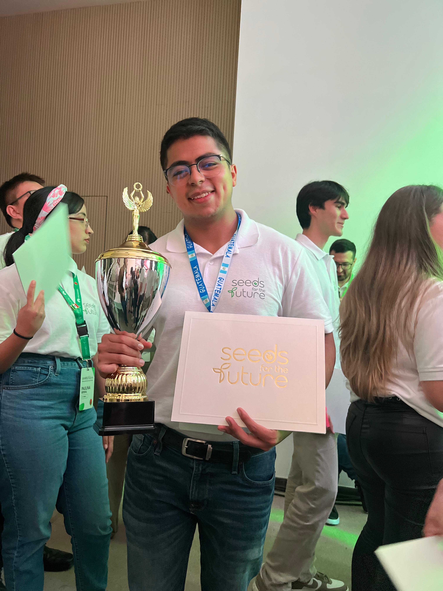

<h1 align="center">👋 Hi, I'm Alberto Josué Hernández Armas</h1>
<h3 align="center">A Passionate Computer Science Student and AI Enthusiast from Guatemala</h3>

  
  
  

## 📚 About Me

- 🎓 **Education**: Currently pursuing a Bachelor's Degree in Computer Science at Universidad de San Carlos de Guatemala.
- 🌐 **Languages**:
  - 
  - 
  - 
  - 
- 🎸 **Musician**: Professional guitarist with experience in both teaching and performing.
- 🏆 **Achievements**:
  - **Tech4Good Competition (2024)**: Awarded **third place** among top teams in Latin America and the Caribbean for developing an innovative tech solution addressing critical social challenges.
  - **Huawei Seeds for the Future Program (2024)**: Selected participant in a highly competitive program focusing on ICT technologies and global networking.

  

## 🛠️ Technical Skills

  
  
  
  
  
  <!-- Add more icons as needed -->

- **Programming Languages**: Python, JavaScript, Java, Rust, C++
- **Frameworks**: Node.js, React, FastAPI, Flask, Actix
- **Databases**: Firebase
- **Cloud Services**: AWS (EC2, S3, Amplify, Textract), Azure (Blob Storage, AI Cognitive Services)
- **AI and Machine Learning**: OpenAI (GPT-3, GPT-4, TTS, Vision), TensorFlow, YOLOv9 (fine-tuning), Vector Databases (Pinecone)
- **Tools & Technologies**: Docker, REST APIs, PayPal SDK, Auth0
- **Version Control**: GitHub

## 🚀 Projects

### [TemisGPT](https://www.temisgpt.io)
An AI Legal Assistant that provides responses based on legal documentation using GPT models. Designed with a user-friendly interface and semantic search embedding with an LLM pipeline. Currently supporting over 1000 active users.

### [MDT](https://main.d22905saq15pol.amplifyapp.com)
A Real-Time Transcription tool utilizing OpenAI Whisper for voice recognition and GPT-4 for summarization. Features include hands-free operation and Voice Activity Detection (VAD).

### [EQUIVALENTES USAC](https://f2equivalentes.fly.dev)
A web-based application featuring a custom programming language for calculating equivalent resistances and capacitances in electrical circuits. Designed to simplify complex calculations and minimize human errors.

## 🌱 Currently Learning

- Deepening my knowledge in **AI and Machine Learning**.
- Exploring new frameworks and tools to enhance web development and cloud computing skills.
- Continuing to learn more about **philosophy**, **ethics**, and their intersection with technology.

## 📫 Get in Touch

- **Email**: [albertoha2000@gmail.com](mailto:albertoha2000@gmail.com)
- **GitHub**: [betebetoven](https://github.com/betebetoven)
- **X (formerly Twitter)**: [@betebetoven](https://twitter.com/betebetoven)

Feel free to check out my repositories, contribute to open-source projects, or just drop a message to say hi!
